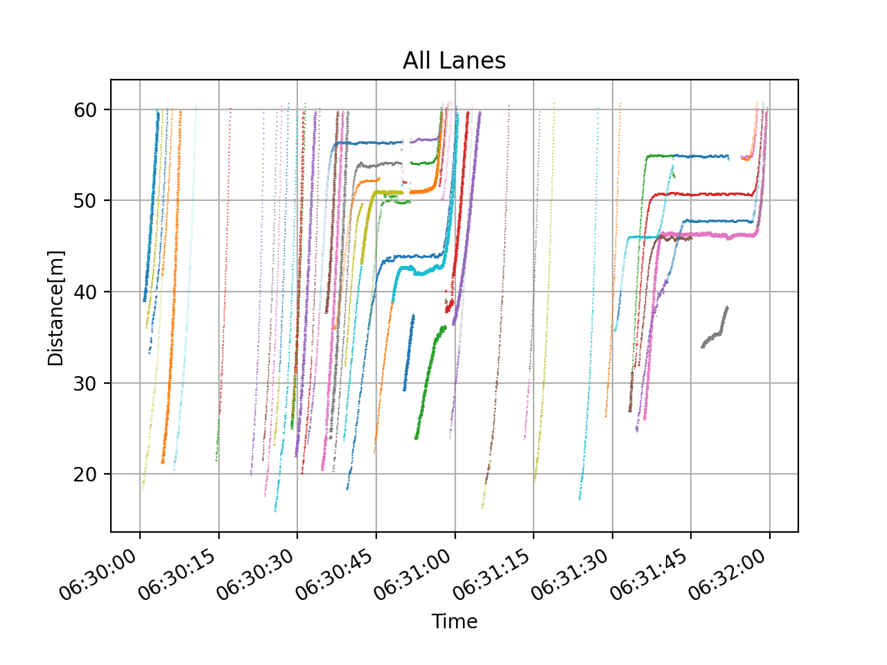
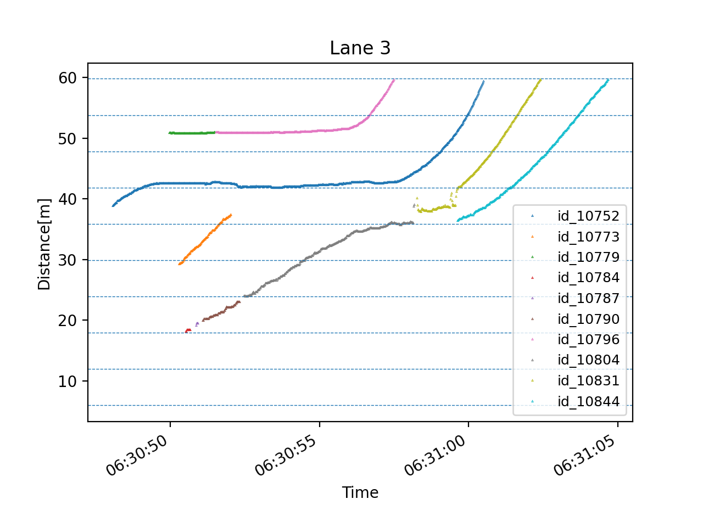
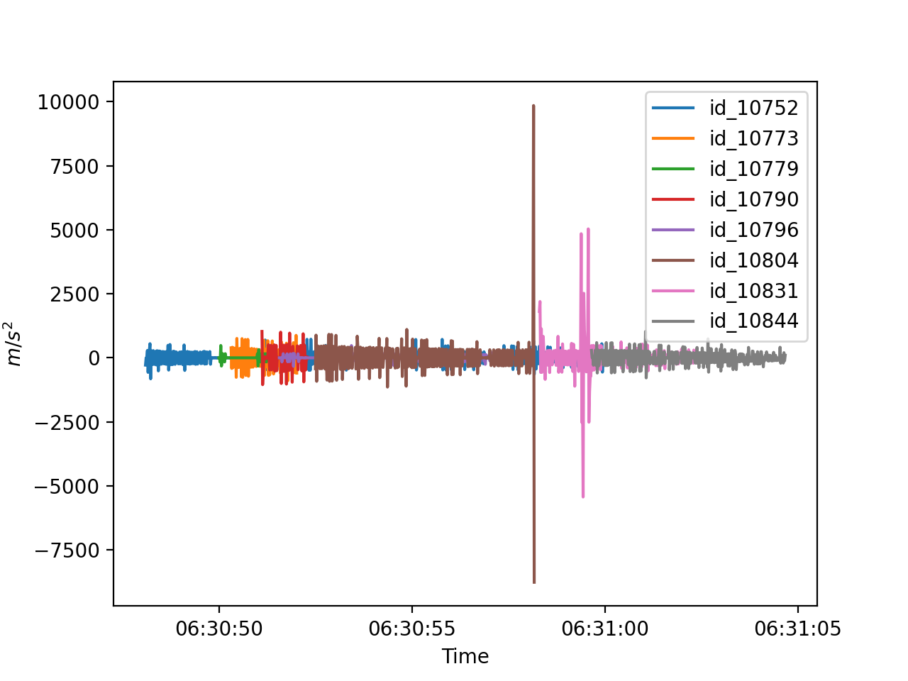
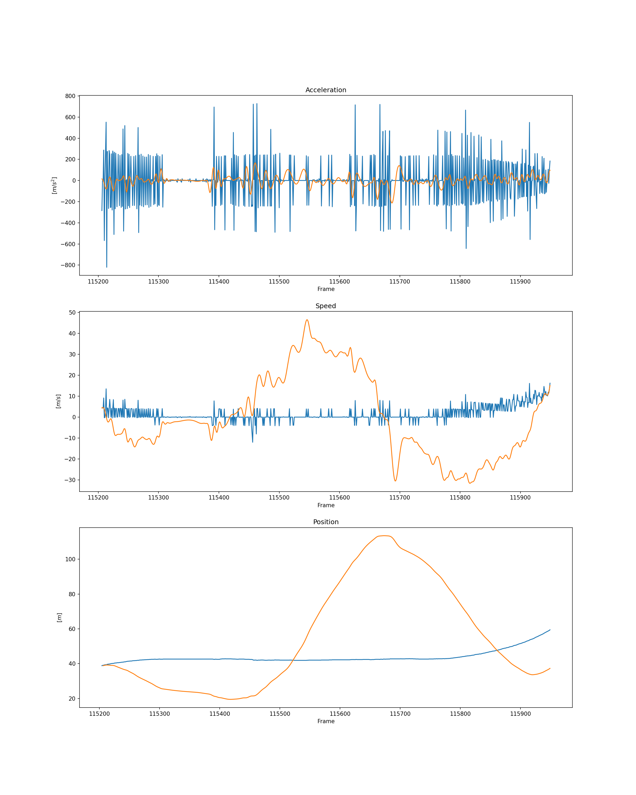
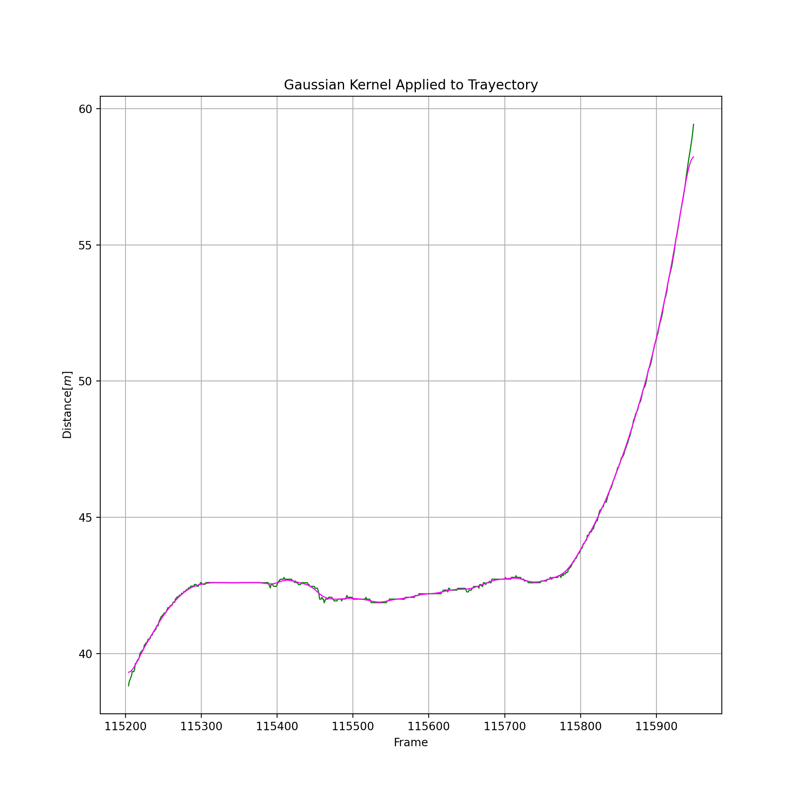
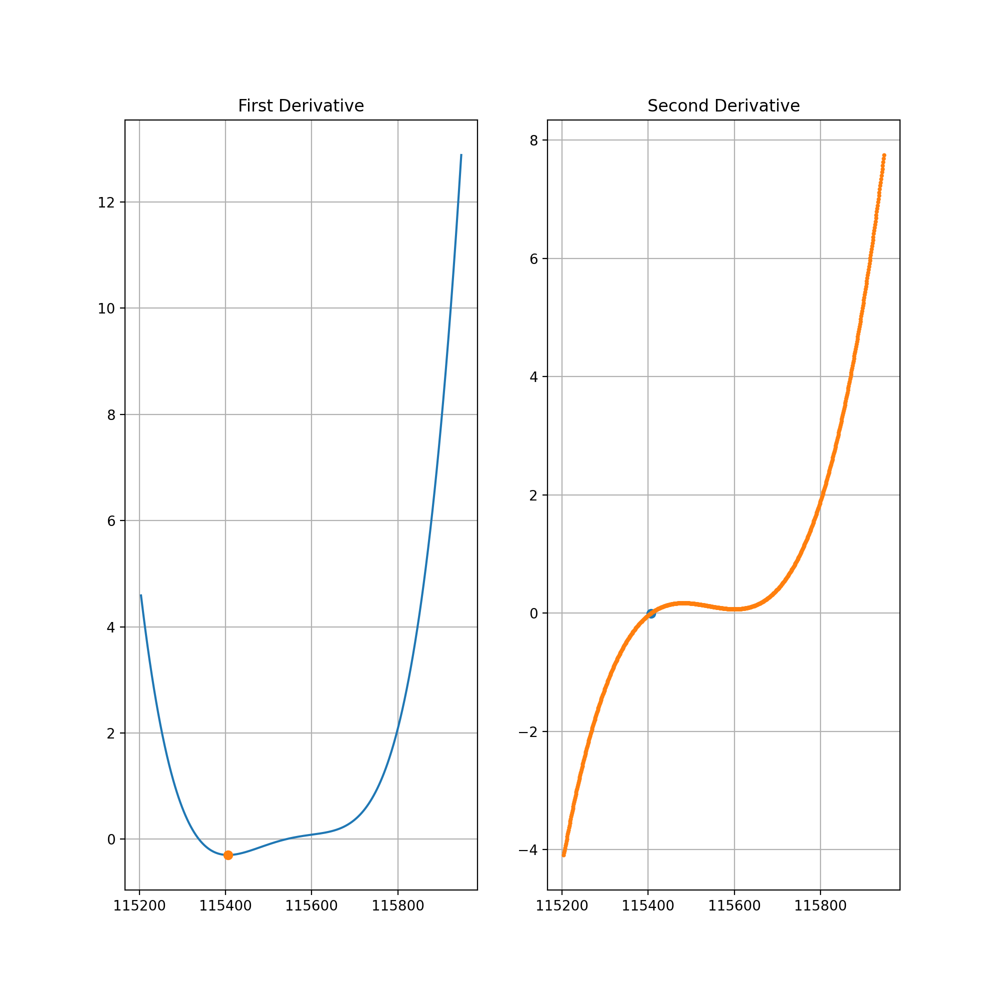
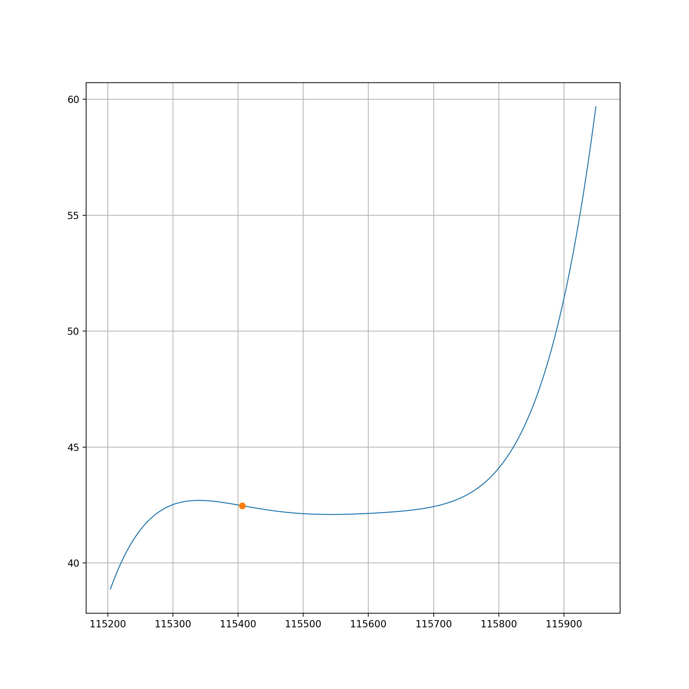
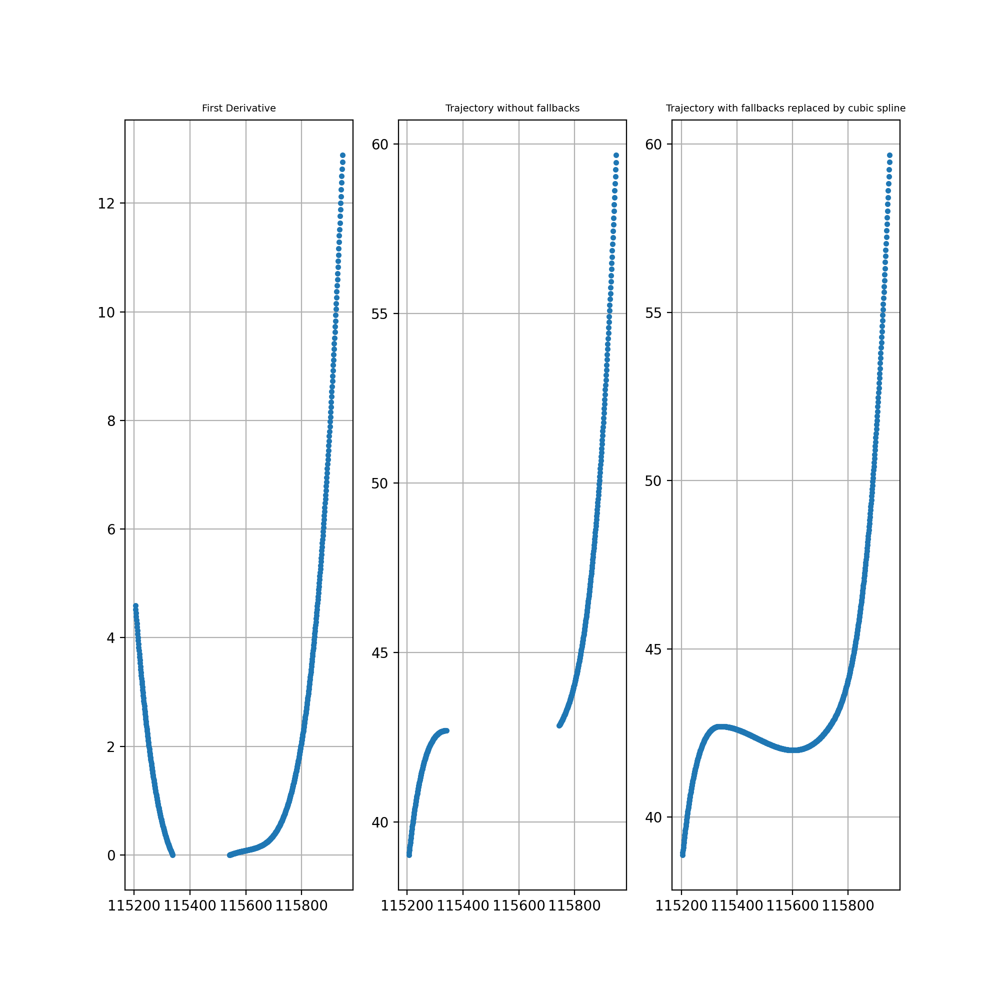
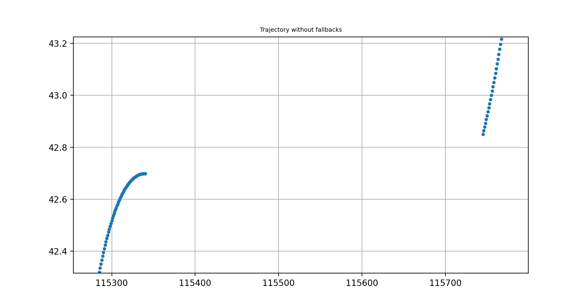

# Vehicle_Trayectory_Dataset
## Experiment Log
Finally we got our traffic space time diagrams but they look like this :'v

Taking the second derivative we get the acceleration.

Taking the EMD to the acceleration signal 

In order to clean the noises in the trajectories we filtered the first, second and third intrinsic mode functions and added the filtered functions to the rest of the IMF, but the results were not as expected. 

We also tried another approach that applies a Gaussian Kernel directly to the trajectories

Taking a polynomial smoothing of the trajectory and locating the inflection point we have

Visualizing the inflection point on the smoothed trajectory

We can see that the inflection point is located approximately where the second derivative changes of sign, but this point is not the point where the cars begin to go backwards, where are going to use the point in the first derivative where it changes sign, this point corresponds to the local maximum and is where the trajectory of the cars begin to go backwards.

Next Day

We used the first derivative negative values to detect the instants of time where the vehicle in the trajectory was going backwards and removed the corresponding points from the trajectory, also we replaced that parts with a cubic spline derived using all the points in the trajectory that were not anomalies. In the reconstructed trajectory we can see that the cubic spline reconstructed the wrong points where the vehicle was going backwards. 

This is due to the cuts made to the trajectory, if we see closely the beginning and ending points, we will see that the tendencies in each cut are different, while the trajectory on the left has reached a peak with a tendency, the trajectory on the right has tendency that suggests a constant growth in value, so when the cubic spline reconstructs the trajectory smoothly decreases the constant growth of the second trajectory to a minimum to finally join to the steady value of the first trajectory.  

